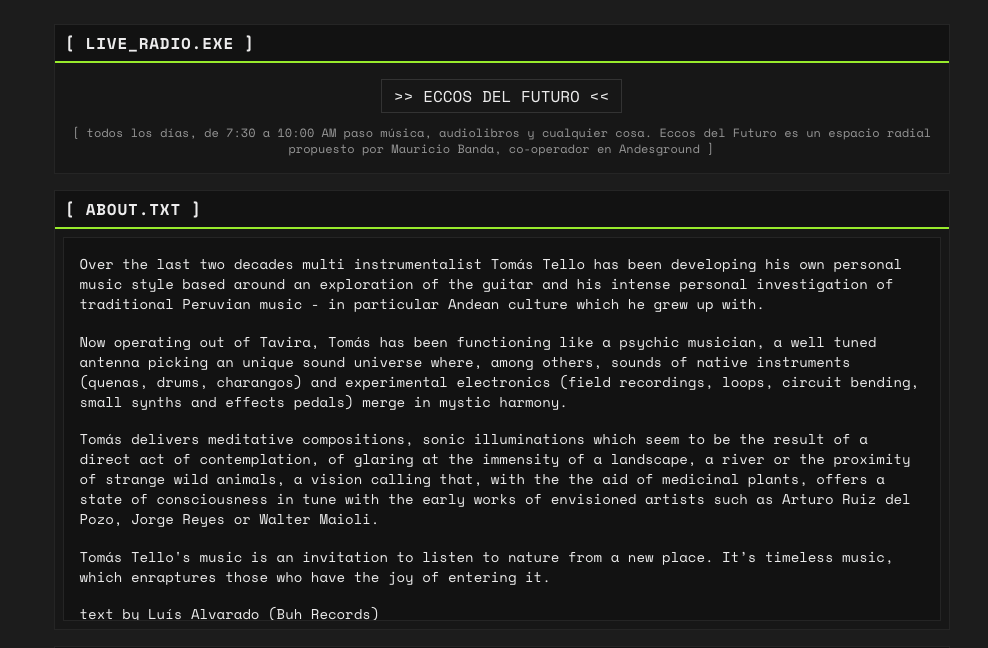

# Tomás Tello — music website

[](https://github.com/zettai/tomastello/actions/workflows/ci.yml)

The official site of Tomás Tello, musician and DJ: live radio, an about page, links, a
music player and a photo gallery, all edited from a protected admin panel. Live at
[tomas-tello.stream](https://tomas-tello.stream).



Built with Next.js 15 (App Router), React 18, TypeScript and Tailwind, with a
retro/terminal window aesthetic. There is no database: content and media live as JSON and
files in an S3-compatible bucket (Scaleway Object Storage).

## Features

**Public page** (`/`)
- Live radio link, about text (Markdown), curated links
- Audio player for an ordered track list
- Photo grid with a keyboard-accessible lightbox

**Admin panel** (`/admin`)
- Edit the about text and manage links
- Upload, describe, select and delete photos
- Upload, reorder and delete audio tracks in multipart chunks (5 MB by default; in relay
  mode only files over 10 MB); a failed chunk is tried up to 3 times before the upload is aborted
- Upload safeguards: per-IP, per-user and daily byte limits, an emergency upload lock, and
  email alerts on abuse (via [Resend](https://resend.com))

**API**
- App Router route handlers under `src/app/api/`
- OpenAPI docs generated from JSDoc, browsable at `/swagger` in development (hidden in
  production unless `ENABLE_API_DOCS=true`)

## Architecture

```
Browser ──▶ Next.js (pages + API routes) ──▶ Scaleway Object Storage (S3 API)
                                              ├─ metadata/site.json    about, links, selected photos
                                              ├─ metadata/images.json  photo metadata
                                              ├─ metadata/audios.json  track metadata + order
                                              ├─ auth/users.json       admin accounts (bcrypt hashes)
                                              ├─ images/               photo files
                                              └─ audio/                audio files
```

- **Storage:** one S3 client (`src/lib/api.ts`); small helpers in `src/lib/` read and write
  each JSON document.
- **Auth:** JWT in an httpOnly cookie, checked by `src/middleware.ts` and by each protected
  route. There are no roles: **every account is a full admin**, so registration must stay off.
  It is off unless `ALLOW_NEW_REGISTRATIONS=true`.
- **Quality:** Jest + Testing Library with `jest-axe` accessibility assertions, pa11y-ci for
  full-page WCAG 2.1 AA scans, ESLint, strict TypeScript, and a SonarQube quality gate (80%
  coverage on new code).

## Getting started

Requires Node.js 22 and a bucket on Scaleway (or any S3-compatible store).

```bash
npm ci --legacy-peer-deps
cp .env.production.example .env.local   # fill in the bucket keys and a JWT secret
npm run dev                             # http://localhost:3000
```

To create the first admin account, start once with `ALLOW_NEW_REGISTRATIONS=true`, register
at `/register`, then switch it back off and restart. Anyone who can register while it is on
gets full admin access.

| Command | What it does |
|---|---|
| `npm run dev` | Dev server (Turbopack) |
| `npm run build` / `npm start` | Production build / serve it |
| `npm test` | Unit and component tests with coverage |
| `npm run lint` | ESLint |
| `npm run typecheck` | TypeScript check, tests included |
| `npm run a11y` | pa11y-ci WCAG 2.1 AA scan (dev server must be running) |
| `npm run e2e:local-s3` | Playwright upload flow against local moto S3 mock |
| `npm run sonar` | SonarQube scan + quality gate (needs `SONAR_TOKEN` / `SONAR_HOST_URL`) |

Local S3 mock (no Scaleway): [docs/LOCAL-S3-DEV.md](docs/LOCAL-S3-DEV.md).

All settings are listed, names only, in [`.env.production.example`](.env.production.example).

## Deployment

The site currently runs as a Docker container on a self-hosted server (see
[DEPLOYMENT.md](DEPLOYMENT.md)). On GitHub, Actions runs lint, typecheck and tests on every
pull request.

## Roadmap

The next step is moving hosting to Netlify serverless functions:

- Browser uploads go straight to the bucket with presigned URLs, so large audio files never
  pass through a function (Netlify caps request bodies at 6 MB)
- The public page is rendered on the server and CDN-cached, for search engines and link
  previews
- One session system on `jose`, and a lighter dependency set

## Repository notes

- [`AGENTS.md`](AGENTS.md) — conventions for AI coding agents (Claude Code); the slash
  commands they use live in `.claude/commands/`
- [`SECURITY.md`](SECURITY.md) — secret handling and how to report a vulnerability

## License

The code is released under the [MIT License](LICENSE). The name Tomás Tello, the branding
and the site's content (text, photos, audio) belong to their owner and are not covered by
it.
